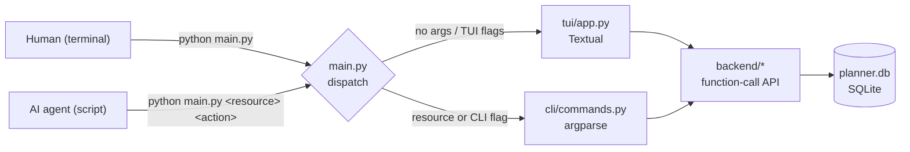
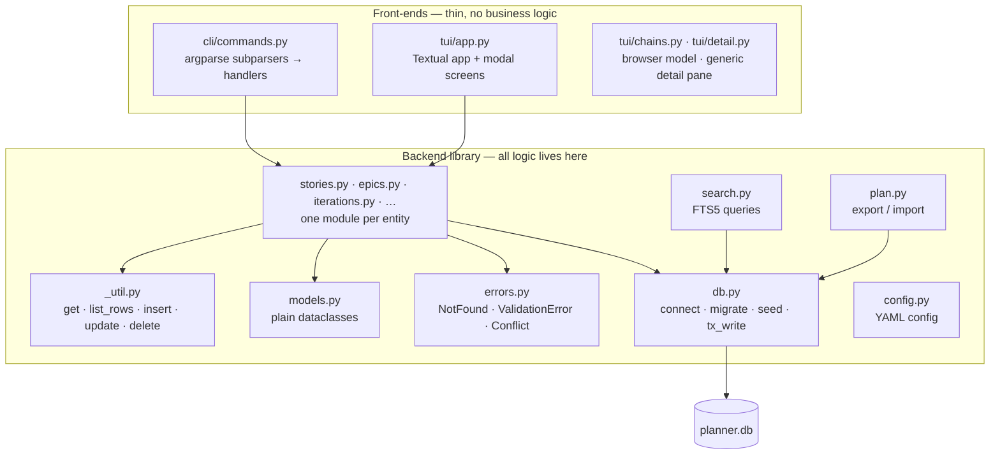
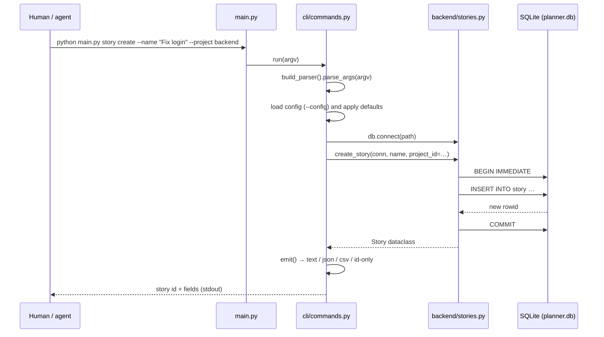
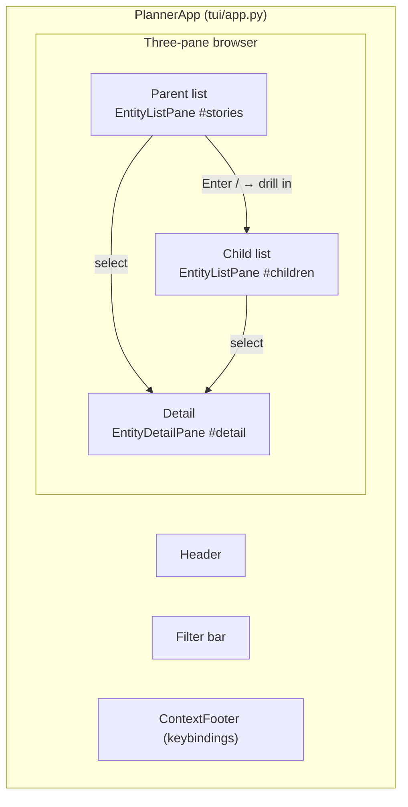
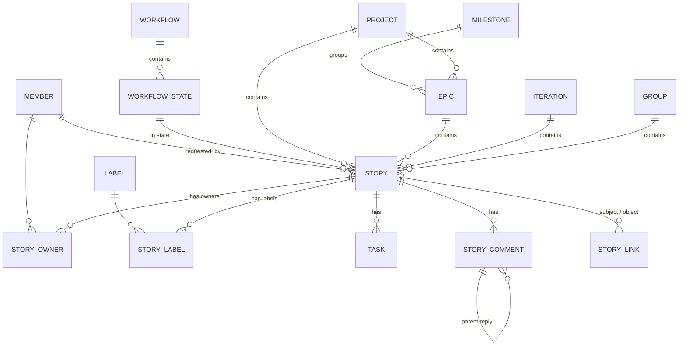
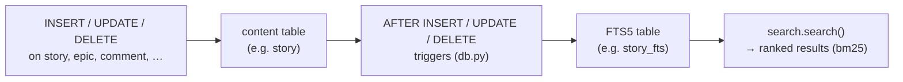

# projectplanner — Development Guide

> This is the **entry point for developers** of `projectplanner` — human or AI.
> It explains what the system is, how it is put together, and how to work on it.
> It is written to get a human up to speed with **low cognitive load**: each
> section opens with the 30-second version, then goes deeper. Read it top to
> bottom once; after that, use the [Appendix](#appendix-quick-reference) as a map.
>
> **If you are an AI agent about to contribute code**, start at
> [CONTEXT.md](../CONTEXT.md) — the single point of contact for contributing.
> It points back here for depth.

**Document map** — what to read when:

| You want to… | Read |
|---|---|
| Understand the *why* (origins, goals, non-goals) | [§1 Origins](#1-origins) |
| Get the whole system in your head fast | [§2 The system in one page](#2-the-system-in-one-page) |
| See how the pieces fit (diagrams) | [§3 Architecture](#3-architecture) |
| Work on the backend library | [§4 The backend library](#4-the-backend-library) |
| Work on the CLI | [§5 The CLI](#5-the-cli) |
| Work on the TUI | [§6 The TUI](#6-the-tui) |
| Understand how the three layers relate | [§7 How the layers relate](#7-how-the-layers-relate) |
| Add or run tests | [§8 Testing](#8-testing-philosophy--methodology) |
| Deploy / back up / upgrade | [§9 Operating the software](#9-operating-the-software) |
| Find a file or a function fast | [Appendix](#appendix-quick-reference) |

**Related documents** (each has a distinct job):

- [`README.md`](../README.md) — the user & integrator guide (full CLI reference, data model, recipes).
- [`AGENTS.md`](../AGENTS.md) — how an AI agent *operates* the CLI as a tool.
- [`CONTEXT.md`](../CONTEXT.md) — the AI contributor's single point of contact for picking up work.
- [`SDLC.md`](../SDLC.md) — the AI-orchestrated development *process* used to build this repo (context for AI users of the tool, not code documentation).
- [`Shortcut Rest API, V3.html`](../Shortcut%20Rest%20API,%20V3.html) — the on-disk reference that inspired the data model (see [§1](#1-origins)).

---

## 1. Origins

### 1.1 The seed: Shortcut's data model as inspiration

`projectplanner` began as a design conversation about building a **local,
personal project-planning tool** to be shared with AI coding systems. The
starting point was Shortcut's (formerly Clubhouse) v3 data model, captured in the
on-disk reference `Shortcut Rest API, V3.html`.

The key decision, made early and never re-litigated: **Shortcut is inspiration
only, not a contract.** The tool does *not* call the Shortcut REST API, is *not*
a faithful mock of it, and does not reproduce its JSON shapes or endpoints. It
borrows the *entity vocabulary* — story, epic, iteration, milestone, project,
workflow, label, member, group, task, comment — because that vocabulary is
familiar and well-shaped, and keeps the field *names* for the fields it carries.
Everything else is a trimmed, local schema.

### 1.2 Goals

- **Local-first, zero-dependency-by-default.** One SQLite file (`planner.db`).
  The backend and CLI use only the Python 3.12 standard library (`sqlite3`,
  `argparse`, `dataclasses`, `datetime`). The TUI adds one dependency:
  [Textual](https://textual.textualize.io).
- **Scriptable and agent-friendly.** The CLI is the automation surface: stable,
  greppable output by default, `--format json` for reliable parsing, and every
  mutating command echoes the resulting entity so the caller learns the new id.
- **Simple, understandable model.** A story is a unit of work; everything else
  is a container or an attachment.
- **Concurrency-safe enough for multiple agents.** Several processes may write
  at once; writers serialize via SQLite's file lock with a 5s busy timeout.
- **No server, no async, no cache.** An in-process library plus two thin
  front-ends (CLI, TUI) over the same backend functions.

### 1.3 Non-goals (YAGNI guardrails)

- No real Shortcut API calls, no network, no auth beyond one implicit local user.
- No multi-workspace; one local DB, one member.
- No pagination protocol — lists return in full (add limits only if a list
  actually grows large).
- No webhooks, integrations, file uploads, history tracking, or custom fields.
- No caching, async, or server.
- No WAL mode (see [§3.5](#35-concurrency-model)) — revisit only if
  read-during-write contention becomes real.

### 1.4 Locked decisions (the contract)

These are settled. Don't re-litigate them unless the user explicitly asks:

1. **Purpose:** personal/local planning tool, shared with AI agents.
2. **Scope:** a core set of resources now; the rest deferred until needed.
3. **Data fidelity:** sensible local schema, Shortcut-flavored *names* only.
4. **`main.py` modes:** no args → TUI; args → CLI. Both share one backend.
5. **Storage:** single local SQLite file `planner.db` in the repo root.
6. **Concurrency:** writers *block* (not error) via `busy_timeout` +
   `BEGIN IMMEDIATE`. Single-writer-at-a-time is accepted behavior.

---

## 2. The system in one page

**One-line mental model:** a story is a unit of work; it lives in a workflow
state, may belong to a project/epic/iteration/group, and carries owners, labels,
tasks, comments, and links. You create stories, move them through states, and
search them — all from the command line, against a local file.

**Three layers, one backend.** All logic lives in the `backend/` library as
plain Python functions over SQLite. The CLI (`cli/commands.py`, argparse) and
the TUI (`tui/app.py`, Textual) are thin front-ends that call the same
functions. There is no separate data layer, no ORM, no server.



**The data flow in one breath:** a command (CLI or TUI) opens a connection to
`planner.db`, calls one or more backend functions, and renders the returned
dataclasses. Backend functions take the `sqlite3.Connection` as their first
argument, run raw SQL, and return plain dataclasses (or raise a typed error).
Writes go through a `BEGIN IMMEDIATE` transaction so concurrent writers
serialize.

---

## 3. Architecture

### 3.1 Layered architecture



**The rules that keep this clean:**

- **Function-call API, not REST.** Each REST-shaped operation is a plain
  function in a `backend/*.py` module, e.g. `GET /stories/{id}` →
  `stories.get_story(conn, id)`. The CLI and TUI are thin layers.
- **Connection is passed, not global.** `db.connect(db_path)` returns a
  configured connection; every function takes `conn` first. This makes
  concurrent-call boundaries explicit and everything trivially testable.
- **No ORM.** Raw SQL via `sqlite3`, plain dataclasses for return values, and a
  small shared helper (`_util.py`) for the common get/list/insert/update/delete
  shapes. `_util` maps `sqlite3.IntegrityError` to the project's own error types.
- **"No logic duplicated in the TUI."** The TUI fetches everything through the
  same backend `get_*`/`list_*` functions; it adds no parallel query logic.

### 3.2 Control flow: a CLI command



Notes:

- `main.py` routes to the CLI only when the first token is a resource name or a
  CLI flag; anything else (including nothing) launches the TUI. This is why
  `--help`/`--version` must stay in the CLI's flag set — see
  [§5.4](#54-the-run-flow).
- `run()` catches `PlannerError`, prints `error: <message>` to stderr, and
  returns exit code 1. Argparse usage errors exit 2. Success exits 0.
- `--dry-run` copies the DB to a temp file, runs the command against the copy,
  and discards it — a safe way to preview a mutating command.

### 3.3 Control flow: the TUI

The TUI is a single Textual `App` (`tui/app.py`). On mount it opens one
connection (`db.connect`) and keeps it for the session, closing it on unmount.
Every action handler calls the same backend functions the CLI uses. The app is
event-driven: key bindings dispatch to `action_*` methods, which read the
current selection, call a backend function, and re-render the panes.

The TUI's navigation model is a **three-pane Miller-columns browser**:



- **Parent list** (top-left) lists an entity kind — switchable between story,
  epic, iteration, milestone, project, group, workflow, label, member.
- **Child list** (bottom-left) shows the selected parent's children, per the
  declarative chain model in `tui/chains.py` (e.g. `project → epic`,
  `epic → story`, `story → task`).
- **Detail pane** (right) renders the selected row via the generic
  `EntityDetailPane` (`tui/detail.py`), which is data-driven per entity kind.
- **Drill-in/out** (Enter/→, ←/Esc) pushes/pops a navigation stack; **zoom**
  (`z`) collapses to two panes; **multi-select** (`v`, Space) enables bulk
  operations; **`?`** opens a context-sensitive help overlay; **Ctrl+P** is a
  fuzzy command palette; **`a`** toggles auto-refresh polling.

### 3.4 Storage & schema

- **File:** `planner.db` in the repo root (gitignored). Created + seeded on
  first connect.
- **Ids:** integer autoincrement primary keys everywhere.
- **Timestamps:** TEXT ISO-8601 UTC (`created_at`, `updated_at`,
  `completed_at`), written by `db.now()` — deliberately *not*
  `CURRENT_TIMESTAMP`, which yields naive local-ish strings.
- **Position:** REAL, so stories can be reordered by inserting between values.
- **Foreign keys:** enforced (`PRAGMA foreign_keys = ON`). **CASCADE** for owned
  children (tasks, comments, story_owner, story_label, story_link,
  workflow_state); **SET NULL** for optional parent links on stories.
- **`group` is a SQLite keyword**, so `_util._q()` double-quotes every table
  identifier in generated SQL.



**Migrations.** A `schema_version` table tracks an integer version. On connect,
`db._migrate()` applies any pending versioned statements, each inside one
`BEGIN IMMEDIATE` transaction. Statements are idempotent (`CREATE TABLE IF NOT
EXISTS`, …) so a partially-applied migration can re-run safely. Current version:
**4**.

| Version | What it added |
|---|---|
| 1 | Core tables + first-run seed (member, default workflow + states) |
| 2 | FTS5 over `name`+`description` for story/epic/project/milestone/iteration/label |
| 3 | FTS5 over comment `text` and task `description` (with a `rebuild` backfill) |
| 4 | `workflow_state.description` column |

**First-run seeding** (`db._seed`) runs only when the `member` table is empty:
one member (name from `$USER`, mention name derived) and a **Default** workflow
with three states — Unstarted (`unstarted`), Started (`started`), Done
(`done`) — with Started as the workflow default.

### 3.5 Concurrency model

Multiple AI agents / processes may write concurrently. The design accepts
**single-writer-at-a-time** and makes writers *block* rather than error:

- Every connection sets `PRAGMA busy_timeout = 5000` (5s) and
  `PRAGMA foreign_keys = ON`.
- Writes go through `db.tx_write(conn)`, a context manager that does
  `BEGIN IMMEDIATE` (acquires the write lock up front) and commits or rolls
  back. The second writer blocks until the first commits, then proceeds.
- Reads use the default (deferred) mode.
- **WAL is intentionally off** (YAGNI). If read-during-write contention is ever
  observed, `PRAGMA journal_mode=WAL` + keeping `busy_timeout` is the one-line
  fix.

### 3.6 Search (FTS5)

Search is FTS5 **external-content** virtual tables kept in sync by triggers:



- The FTS tables and their sync triggers are created by migrations v2 and v3 in
  `db.py`; `backend/search.py` only *queries* them.
- Triggers are the single source of truth for index sync, so even a direct SQL
  edit stays indexed.
- Queries are passed straight to FTS5 `MATCH`, so `login OR auth`, `log*`
  (prefix), and `"exact phrase"` all work. Results are ranked by bm25 (negated
  so bigger = better) and carry entity type + id + display name.
- `search.search(conn, query, entity=None, limit=, offset=)` covers eight
  entity types: story, epic, project, milestone, iteration, label, comment, task.

### 3.7 Configuration

`backend/config.py` loads a flat YAML file (see `planner.example.yaml` for the
fully-commented reference). Precedence: **CLI flags > config file > built-in
defaults**. Every setting the CLI exposes as a flag has a matching field, so
the file doubles as documentation. `config init` writes a default file;
`config show` prints the effective config.

### 3.8 Plan export/import & backup

- **`plan export` / `plan import`** (`backend/plan.py`) dump/restore the entire
  plan as a portable JSON snapshot. Import wipes all content rows and re-inserts
  inside one `BEGIN IMMEDIATE` transaction, **remapping primary keys** so
  foreign-key links survive even though ids change. This is how plan state is
  shared across environments or reconciled.
- **`plan backup`** copies `planner.db` to a timestamped file and prunes old
  backups (`--keep N`). The global `--rotate-backup N` flag auto-backs-up before
  every write, keeping the N most recent rotations.

---

## 4. The backend library

**30-second version:** `backend/` is a function-call API over SQLite. Each
entity has one module (`stories.py`, `epics.py`, …) exposing `list_*`,
`get_*`, `create_*`, `update_*`, `delete_*` functions. Every function takes
`conn` first, uses `_util` for the common SQL shapes, returns plain dataclasses
from `models.py`, and raises typed errors from `errors.py`.

### 4.1 The pieces

| File | Job |
|---|---|
| `db.py` | `connect()` (pragmas, migrate, seed), `tx_write()`, `now()`, migrations, FTS trigger builder |
| `errors.py` | `PlannerError` base + `NotFound(resource, id)`, `ValidationError(msg)`, `Conflict(msg)` |
| `models.py` | One dataclass per entity (`Model` base with `from_row`/`to_dict`), plus `StoryDetail` |
| `_util.py` | `get`, `list_rows`, `insert`, `update`, `delete`; quotes identifiers; maps `IntegrityError` → `Conflict`/`ValidationError` |
| `members.py` `groups.py` `workflows.py` `projects.py` `labels.py` | Parent/roster entities |
| `milestones.py` `epics.py` `iterations.py` `stories.py` | Planning containers + the central story |
| `tasks.py` `comments.py` `story_links.py` | Story children |
| `search.py` | FTS5 queries (see [§3.6](#36-search-fts5)) |
| `plan.py` | Export/import snapshot (see [§3.8](#38-plan-exportimport--backup)) |
| `config.py` | YAML config load/save (see [§3.7](#37-configuration)) |

### 4.2 The function-call contract

- **`conn` first, always.** `stories.get_story(conn, id)` — never a global
  connection. This is what makes concurrent-call boundaries explicit and tests
  trivial (each test gets its own connection to a temp DB).
- **Dataclasses out.** Functions return `models.py` dataclasses (or lists of
  them). `StoryDetail` is a composite: the story plus owners, labels, tasks,
  and workflow state.
- **Typed errors.** `NotFound` when a referenced entity doesn't exist,
  `ValidationError` for invalid args / CHECK violations, `Conflict` for
  uniqueness violations (e.g. a duplicate story link).
- **Writes go through `tx_write`.** Every mutating function wraps its work in
  `with db.tx_write(conn):` so the write lock is taken up front and the
  transaction commits or rolls back atomically.

### 4.3 Key behaviors (invariants to preserve)

- **`completed_at` is automated.** Moving a story/epic/milestone into a
  `done`-typed state stamps `completed_at`; moving out clears it. Never set it
  manually.
- **Position defaults to max+1** within the same project (or globally if no
  project), so new stories sort to the end. Reordering swaps `position` values.
- **Default state.** `create_story` with no explicit state uses the default
  workflow's `default_state_id` (seeded = Started).
- **Delete semantics.** Deleting a story cascades to its tasks, comments,
  story-links, owners, and labels. Deleting a project/epic/iteration/group/
  milestone/member **sets the story's FK to null** (the story survives).
  Projects and groups are *soft-deleted* via an `archived` flag.
- **Story links** are directed `(subject, verb, object)` triples with
  `verb ∈ {blocks, blocks_by, duplicates, duplicated_by, relates_to}`; the
  triple is unique and a story cannot link to itself.

### 4.4 How to add a new entity (walkthrough)

Say you're adding a deferred entity, e.g. **Document**:

1. **Schema.** Add a `_SCHEMA_V5` list in `db.py` with the `CREATE TABLE`
   statement(s), append `(5, _SCHEMA_V5)` to `_MIGRATIONS`, and bump
   `CURRENT_SCHEMA_VERSION` to 5. Keep statements idempotent.
2. **Model.** Add a `Document(Model)` dataclass in `models.py` (fields match
   the columns; inherit `Model` for `from_row`/`to_dict`).
3. **Module.** Create `backend/documents.py` with `list_documents`,
   `get_document`, `create_document`, `update_document`, `delete_document`
   using `_util` helpers and `db.tx_write` for writes. Follow the shape of an
   existing simple module (`labels.py` is a good template).
4. **Search (optional).** If it should be searchable, add an FTS table +
   triggers in the migration and an entry in `search._ENTITIES`.
5. **Plan (optional).** If it should survive export/import, add it to
   `plan._TABLES` (and `_WIPE_ORDER`, children before parents).
6. **Tests.** Add `tests/test_documents.py` covering CRUD, invariants, and
   cascade behavior. Run `ruff` + `pytest` before committing.

---

## 5. The CLI

**30-second version:** `cli/commands.py` builds one big argparse parser:
resource subparsers (`story`, `epic`, …) each with action subparsers (`list`,
`create`, …). Each action sets `func` (a handler) and `fmt` (a text formatter).
`run(argv)` parses, loads config, opens a connection, calls `args.func(conn,
args)`, and renders the result via `emit()`.

### 5.1 Structure

- **`build_parser()`** constructs the whole tree. Every resource subparser
  inherits `COMMON` (a parent parser with `--json`, `--format`, `--dry-run`),
  so those flags work anywhere after the resource name. The top-level parser
  also carries `--version`, `--db`, `--rotate-backup`, `--config`.
- **Handlers** (`h_story_create`, `h_epic_list`, …) are thin: they resolve
  names to ids, call the backend, and return a value. Formatting is separate —
  each action sets a `fmt` callable used only for text mode.
- **`emit(args, value, text_fn=…)`** renders according to `--format`
  (`text`/`json`/`csv`/`id-only`); `--json` is a deprecated alias for
  `--format json`.

### 5.2 Conventions an agent can rely on

- **Name or id, your choice.** Anywhere a human would type a name
  (`--project backend`, `--owner chris`, `--labels bug,auth`) it resolves to an
  id case-insensitively. A bare number is used as an id directly. Ambiguous
  names error with the matching ids. **Stories are referenced by id** (names
  are not unique).
- **`--state`** on `story move` accepts a state id, a state name (`"Done"`),
  or a state type (`unstarted`/`started`/`done`).
- **Mutating commands echo the resulting entity** — this is how the caller
  learns the id just assigned.
- **Exit codes:** `0` success, `1` backend error (`NotFound`/`ValidationError`/
  `Conflict`), `2` argparse usage error.
- **`$EDITOR` for long text.** `story edit <id>`, and `comment add` / `task
  add` with no `--text`/`--desc`, open `$VISUAL`/`$EDITOR` (fallback `vi`) on a
  buffer; a non-zero editor exit aborts with no change.

### 5.3 Resources

`story` `epic` `iteration` `milestone` `project` `label` `member` `group`
`workflow` `task` `comment` `link` `search` `plan` `config` — 15 resources.
The full per-action flag list is in `README.md §CLI Reference` (or
`python main.py <resource> <action> -h`); this doc doesn't duplicate it.

### 5.4 The `run()` flow

1. `build_parser().parse_args(argv)`.
2. Load config from `--config` (if given) and fill unset args from it or from
   built-in defaults (`_apply_config_defaults`). CLI flags always win.
3. Resolve the DB path (`--db` or `db.DEFAULT_DB_PATH`).
4. If `--rotate-backup N` and not `--dry-run`: copy the DB to a timestamped
   file and prune to N rotations.
5. If `--dry-run`: copy the DB to a temp file and run against the copy.
6. `db.connect(path)`, call `args.func(conn, args)`, render via `emit()`.
7. Catch `PlannerError` → `error: <msg>` on stderr, exit 1. Always close the
   connection (and unlink the temp file).

### 5.5 How to add a command

1. In `build_parser()`, add an action subparser under the resource (or a new
   resource subparser).
2. Add the flags, then `p.set_defaults(func=h_my_action, fmt=_fmt_one)`.
3. Write `h_my_action(conn, a)` — resolve names, call the backend, return a
   value.
4. Add a test in `tests/test_cli.py` (use the `run_cli` fixture pattern).

---

## 6. The TUI

**30-second version:** `tui/app.py` is a Textual `App` that opens one
connection for the session and renders a three-pane entity browser. Navigation
is data-driven: `tui/chains.py` declares which parent→child relationships the
browser can show, and `tui/detail.py` declares how each entity kind renders in
the detail pane. Every action calls the same backend functions as the CLI.

### 6.1 The pieces

| File | Job |
|---|---|
| `tui/app.py` | The `PlannerApp` (layout, bindings, `action_*` methods, modal screens, edit panes) |
| `tui/chains.py` | Declarative parent→child chain model (`CHAINS` + `resolve_children` + `valid_children`) |
| `tui/detail.py` | Generic `EntityDetailPane` — data-driven per-entity detail layouts with related-entity links |

### 6.2 The chain model (`tui/chains.py`)

A *chain* is a directed `(parent, child)` pair of entity kinds the browser can
show directly, mapped to a resolver `(conn, parent_id) → list[child_row]`:

```
project → epic      project → story      milestone → epic
epic → story        iteration → story    group → story
workflow → state     label → story        member → story
story → task
```

Drill-in/out, entity switching, and zoom all consume this one table instead of
each re-deriving relationships. Multi-hop navigation (e.g. reaching an epic
from a label) is done by drilling from a story to its parent epic, not via a
dedicated chain.

### 6.3 The detail pane (`tui/detail.py`)

`EntityDetailPane` renders *any* entity kind from a small data-driven layout:
`Field` rows (`label: value`), `Section`s (e.g. tasks, comments), and
`RelatedLink`s that carry a target entity kind + id. All data comes from the
backend `get_*`/`list_*` functions — the TUI adds no parallel query logic.

### 6.4 Key bindings

The full set is in `PlannerApp.BINDINGS` and shown in the footer. The
highlights: `n` new, `u` update, `m` move, `c`/`C` comment, `t`/`x` task,
`o`/`l` owners/labels, `h` links, `f` filter, `/` search, `b` browse,
`s`/`E`/`I`/`M`/`P`/`G`/`W`/`L`/`R` switch entity, `S` plan, `B` config,
`r` refresh, `a` auto-refresh, `J`/`K` reorder, `d`/`D` delete, `e` toggle
complete, `v` multi-select, `z` zoom, `?` help, `Ctrl+P` palette, `q` quit.

### 6.5 The "thin layer" rule

The TUI must stay a thin layer over `backend/*`:

- Fetch data only through backend `get_*`/`list_*` functions.
- Route state changes through backend functions (e.g. `move_story_state`) so
  invariants like `completed_at` stay consistent.
- Confirm destructive actions; surface backend errors in the UI.
- Guard every action that assumes a specific entity kind (a story-only action
  must no-op when browsing epics).
- Scope transient state (search, selection, filters) to the navigation context
  and clear it on switch/drill/zoom.

### 6.6 How to add a TUI feature

1. Add a `Binding` in `BINDINGS` (and a palette entry in `_PALETTE_COMMANDS` if
   it should be palette-reachable).
2. Write an `action_my_feature` method that reads the current selection,
   calls a backend function, and re-renders.
3. If it needs a form, add a `ModalScreen` (or an in-pane edit form) that
   dismisses with a result.
4. Add a headless pilot test in `tests/test_tui.py` (Textual's `App.run_test()`
   pilot; skipped if `textual` isn't installed).

---

## 7. How the layers relate

```
        ┌─────────────────────────────────────────────┐
        │            backend/*  (all logic)            │
        │  function-call API · conn-first · dataclasses│
        └──────────────┬──────────────┬────────────────┘
                       │              │
              ┌────────┴───┐    ┌──────┴────────┐
              │  cli/      │    │  tui/         │
              │  argparse  │    │  Textual      │
              │  one-shot   │    │  interactive  │
              └────────────┘    └───────────────┘
```

- **The backend is the contract.** Both front-ends call the same functions with
  the same semantics. There is no separate data layer, no duplicated query
  logic, no second source of truth.
- **The CLI is the automation surface.** Stable, parseable, agent-friendly.
  It is the primary interface for scripts and AI agents.
- **The TUI is the human surface.** A full-screen browser over the same
  functions, adding navigation (chains, drill-in/out, zoom) and forms — but no
  business logic.
- **Connection lifecycle differs.** The CLI opens a connection per invocation
  and closes it. The TUI opens one connection on mount and closes it on
  unmount. Both use `db.connect()` and the same pragmas, so concurrency
  behavior is identical.

---

## 8. Testing philosophy & methodology

**30-second version:** the design makes testing easy — a function-call API with
`conn` passed in means every test gets its own fresh, seeded temp database.
The suite is **180 tests** (pytest), runs in about a minute, and is
`ruff`-clean. CI runs both on every push/PR.

### 8.1 Why the design makes testing easy

- **`conn` is passed, not global.** Each test builds its own connection to a
  temp DB — no mocking, no shared state, no teardown races.
- **Fresh DB per test.** `tests/conftest.py` provides a `conn` fixture (a
  configured, seeded connection to a `tmp_path` DB) and an **autouse** fixture
  that redirects `db.DEFAULT_DB_PATH` to a temp file, so no test can ever touch
  the real `planner.db` — even a call that forgets to pass a path.
- **Typed errors** make failure-mode tests precise (`pytest.raises(NotFound)`).

### 8.2 Test file map

| File | Covers |
|---|---|
| `test_db.py` | connect/migrate/seed idempotency, pragmas, FTS tables + triggers, `tx_write` commit/rollback |
| `test_stories.py` | story CRUD, `completed_at` automation, position defaults, list filters, `StoryDetail`, owner/label helpers, delete cascade, SET NULL |
| `test_parents.py` | epics/milestones/iterations `completed_at` + filters; project/group archive; label/member/workflow CRUD + state rules |
| `test_epics.py` `test_workflows.py` | epic and workflow specifics |
| `test_tasks.py` `test_comments.py` `test_story_links.py` | child entities, threading, verb/self-link/UNIQUE rules, cascade |
| `test_search.py` | FTS5 insert/update/delete sync, entity filter, ranking, boolean/prefix, error cases, comment/task search |
| `test_cli.py` | `run()` with `--format json` shapes, name resolution + ambiguity, `--state` by id/name/type, exit codes, `$EDITOR` flow |
| `test_tui.py` | headless Textual pilot (create/edit/toggle/search/comment/owners/labels/reorder/delete/bulk); skipped if `textual` missing |
| `test_concurrency.py` | two writers serialize (the second blocks until the first commits) |
| `test_chains.py` | the TUI chain model: valid children per parent, resolvers, invalid pairs |
| `test_plan.py` | export/import round-trip, id remapping, wipe order |
| `test_backup.py` | `plan backup` creation + pruning |
| `test_config.py` | config load/save, partial files, CLI-over-config precedence, `config init`/`show` |
| `test_properties.py` | **hypothesis** property tests: `completed_at` automation, position uniqueness, link uniqueness, delete cascade |

### 8.3 Methodology

- **Behavioral, not implementation.** Tests exercise the public function-call
  API and the CLI, not SQL internals.
- **Property tests for invariants.** `test_properties.py` uses
  [hypothesis](https://hypothesis.readthedocs.io/) to check that invariants
  hold across generated inputs (e.g. position uniqueness under many inserts).
- **TUI tests are headless pilots.** Textual's `App.run_test()` drives the real
  app — pressing keys, filling forms, asserting on rendered state — so TUI
  regressions are caught without a terminal.
- **Concurrency is tested.** `test_concurrency.py` proves the
  block-not-error writer behavior with two connections.
- **Fresh DB per test is non-negotiable.** Never point a test at the real
  `planner.db`; use `tmp_path` (or `--db /tmp/…` for manual smoke tests).

### 8.4 Running

```bash
uv sync                      # install runtime + dev deps from uv.lock
uv run python -m pytest -q   # 180 tests, ~1 min
uv run ruff check backend cli tui main.py tests
```

CI (`.github/workflows/ci.yml`) runs `uv sync --frozen` (fails if `uv.lock` is
out of date), then ruff + pytest on Python 3.12 for every push/PR.

### 8.5 What to test when adding a feature

- Backend: CRUD + the invariant you touched (e.g. `completed_at`, position,
  cascade) + error cases.
- CLI: the new command's `--format json` shape, name resolution, exit codes.
- TUI: a headless pilot for the new binding/screen.
- Run the full suite and `ruff` before committing — don't merge red.

---

## 9. Operating the software

### 9.1 Setup

- **Python 3.12+** (stdlib `sqlite3` ships with FTS5).
- Backend + CLI need nothing beyond Python 3.12.
- TUI / dev / tests: `uv sync` (uses `.python-version`; creates a gitignored
  `.venv` and installs runtime + dev deps from the locked `uv.lock`).
- `planner.db` is created and seeded on first run.

### 9.2 Running

```bash
python main.py                          # TUI (needs textual)
python main.py story list               # CLI
python main.py --db /tmp/demo.db story list   # point at a different DB
```

### 9.3 Configuration

Copy `planner.example.yaml` to `planner.yaml` (or run `config init`) and pass
`--config planner.yaml`. Precedence: CLI > config > defaults. See
[§3.7](#37-configuration).

### 9.4 Backup

- **Manual:** `python main.py plan backup --keep 7` — timestamped copy of
  `planner.db`, pruning to the 7 most recent.
- **Automatic:** `--rotate-backup 3` on any command backs up before the write
  and keeps 3 rotations.
- **Portable snapshot:** `plan export --file plan.json` / `plan import
  --file plan.json` — the whole plan as JSON with ids remapped on import. Use
  this to share state across environments or reconcile a DB.

### 9.5 Upgrades

- **Schema migrations are automatic.** On connect, `db._migrate()` applies any
  pending versioned statements inside `BEGIN IMMEDIATE`. There is no manual
  upgrade step — just run the new code against the existing DB.
- **Adding a migration:** bump `CURRENT_SCHEMA_VERSION`, add a `_SCHEMA_VN`
  list, append to `_MIGRATIONS`. Keep statements idempotent. Test against a DB
  that already has data (the v3 `rebuild` backfill is the pattern for
  backfilling FTS).
- **Rolling back** is not supported by design (migrations are forward-only);
  back up before upgrading if you may need to revert.

### 9.6 Troubleshooting

| Symptom | Likely cause / fix |
|---|---|
| `database is locked` | A writer held the lock > 5s. Retry, or raise `busy_timeout`. |
| Search misses recently edited rows | FTS triggers should keep it in sync; if a DB predates v2/v3, run the `rebuild` backfill. |
| `error: story 999 not found` | Stale id (exit 1, recoverable). Re-list and use a fresh id. |
| `argument --type: invalid choice` | Usage bug in *your* command (exit 2). Re-read `-h`. |
| TUI won't start | `textual` not installed — `uv sync` or `pip install textual`. |
| `group` SQL errors | The table is a keyword; identifiers must be quoted (`_util._q`). |

---

## Appendix: quick reference

### File map

```
main.py                 entry point: no args → TUI; resource/flag → CLI
backend/
  db.py                 connect · pragmas · migrations · seed · tx_write
  errors.py             NotFound · ValidationError · Conflict
  models.py             dataclasses (one per entity) + StoryDetail
  _util.py              get/list/insert/update/delete + identifier quoting
  <entity>.py           members groups workflows projects labels milestones
                        epics iterations stories tasks comments story_links
  search.py             FTS5 queries
  plan.py               export / import snapshot
  config.py             YAML config
cli/commands.py         argparse tree · handlers · emit() · run()
tui/app.py              PlannerApp · bindings · modal screens · edit panes
tui/chains.py           declarative parent→child chain model
tui/detail.py           generic EntityDetailPane
tests/                  pytest suite (180 tests) + conftest.py
.github/workflows/ci.yml  ruff + pytest on 3.12
planner.example.yaml    commented config reference
```

### Exit codes

| Exit | Meaning |
|---|---|
| `0` | success |
| `1` | backend error (`NotFound` / `ValidationError` / `Conflict`) |
| `2` | argparse usage error |

### Key invariants to preserve

- `completed_at` is automated by state moves — never set it manually.
- Writes go through `db.tx_write` (`BEGIN IMMEDIATE`); never write outside it.
- The TUI adds no business logic — fetch and mutate only via backend functions.
- Tests never touch the real `planner.db` (autouse fixture guards this).
- `group` is a SQLite keyword — quote identifiers in generated SQL.
